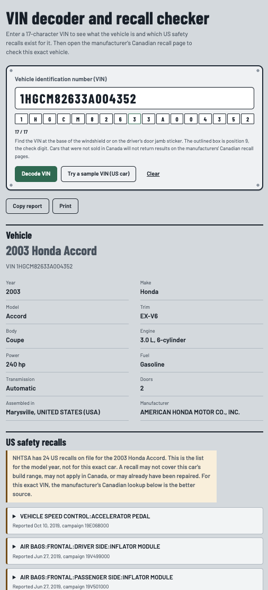

# VIN Decoder and Recall Checker

A free, no-login web tool that decodes a 17-character Vehicle Identification Number (VIN), lists US safety recalls for that make, model and year, and links to Transport Canada's official recall lookup.

Built for people shopping for a used car in Canada, including on a phone in a dealership lot.

**Live demo:** https://tsoybay.github.io/vin-decoder/



## What it does

1. **Checks the VIN locally.** Confirms 17 characters, rejects the letters I, O and Q (never used in VINs), and verifies the check digit in position 9 to catch typos. No network needed for this step.
2. **Decodes the vehicle.** Year, make, model, trim, body, drivetrain, engine, fuel, transmission and where it was assembled, from NHTSA's vPIC API.
3. **Lists US recalls.** Looks up recalls by make, model and year with NHTSA's recalls API, newest first, with the component, risk and fix for each.
4. **Links to the manufacturer's Canadian recall lookup.** Based on the decoded make, the tool links straight to that manufacturer's own Canadian recall page, taken from Transport Canada's list of manufacturers. You copy the VIN, paste it there, and check this exact vehicle.
5. **Handles problems clearly.** Bad VIN, no internet, a slow API, or a vehicle NHTSA doesn't recognize each get a plain message instead of a broken page.

You can also copy the report as text or print it.

## About the sample VIN

The **Try a sample VIN (US car)** button uses `1HGCM82633A004352`, a sample VIN from NHTSA's public documentation. It is a 2003 Honda Accord built in Ohio and sold in the US, **not in the Canadian market**.

So when you press **Open Honda recall lookup** and paste it into honda.ca, the site answers "No results found". That is expected, not a bug: Honda Canada's page only covers vehicles sold through its Canadian dealer network. The sample shows the VIN check, the decode and the US recalls. To see the Canadian handoff return a result, use the VIN of a car that was sold in Canada.

I did not put a real Canadian car's VIN in this project because a VIN identifies one specific vehicle.

## Limitations (read these)

- **US recalls are matched by make, model and year, not by VIN.** The tool shows what recalls exist for this kind of vehicle. It cannot tell you whether this exact car was affected or already repaired. The manufacturer lookup it links to is where you check the exact VIN. The tool does not fill in the VIN for you, so copy and paste it.
- **The recalls shown are US recalls.** Canadian recalls can differ.
- **Manufacturer pages only cover vehicles sold in Canada.** A car that was not sold in Canada, including the sample VIN, will return "No results" on those pages. That is normal, not a bug.
- **The manufacturer links are a snapshot.** They were copied from Transport Canada's manufacturer list on October 1, 2026. They are third-party sites and can change, so re-check them from time to time (see `MANUFACTURER_LOOKUPS` in `script.js`).
- **Direct links cover cars, SUVs, light trucks and vans.** Motorcycles and other makes get a link to Transport Canada's manufacturer list instead. Porsche has no online lookup listed, so the tool shows its phone number.
- **Chevrolet, GMC, Buick and Cadillac use General Motors' lookup.** Transport Canada lists only General Motors, so this mapping is an assumption. Confirm it before relying on it.
- **Vehicles built for other markets** (Europe, Japan) often come back with little or no data, because NHTSA's data covers vehicles sold in North America. Many of those VINs also fail the North American check digit test, so the tool shows a warning instead of blocking the lookup.
- **Model names can differ** between NHTSA's VIN decoder and its recall database. The tool retries once with NHTSA's own spelling and tells you when it does.

For information only. Always confirm recalls with the manufacturer or Transport Canada.

## Troubleshooting

- **"Could not reach NHTSA" with a working connection:** the browser is probably blocking the request (a rule called CORS, or a content security policy on the host). Open the browser console (F12) and look for a red error mentioning `Access-Control-Allow-Origin` or `Content Security Policy`.
- **A field shows blank:** NHTSA only returns what manufacturers submitted. Missing values mean NHTSA has no data, not that the feature is absent.

- **"The tool shows recalls but the manufacturer shows none":** expected. The tool lists US recalls on file for the make, model and model year. The manufacturer's Canadian page checks your exact VIN. A recall may not cover your car's build range, may not apply in Canada, or may already be repaired. For one specific car, trust the manufacturer's lookup.

## Tech

Plain HTML, CSS and JavaScript. No framework, no build step, no API keys.

```
vin-decoder/
├── index.html   page structure
├── style.css    styling
├── script.js    VIN validation, API calls, rendering
└── README.md
```

## Run it locally

Open `index.html` in a browser. If your browser blocks requests from a file, run a tiny local server instead:

```bash
python3 -m http.server 8000
```

Then visit http://localhost:8000.

## Test the validation logic

The VIN validation is plain functions you can run in Node:

```bash
node -e "const s=require('./script.js'); console.log(s.validateVin('1HGCM82633A004352'))"
```

## Publish with GitHub Pages

1. Push these files to a new repository on your GitHub account.
2. In the repository, open **Settings → Pages**.
3. Under **Build and deployment**, choose **Deploy from a branch**, pick `main` and `/ (root)`, then save.
4. After a minute your site is live at `https://YOUR-USERNAME.github.io/REPOSITORY-NAME/`. Paste that link at the top of this README.

## Data sources

- [NHTSA vPIC API](https://vpic.nhtsa.dot.gov/api/) for VIN decoding
- [NHTSA recalls API](https://www.nhtsa.gov/nhtsa-datasets-and-apis) for US recalls
- [Transport Canada: Find a vehicle, tire or child car seat manufacturer](https://tc.canada.ca/en/road-transportation/defects-recalls-vehicles-tires-child-car-seats/find-vehicle-tire-child-car-seat-manufacturer) for each manufacturer's Canadian recall lookup (linked, not queried)

## Roadmap

- **Version 2:** Show Canadian recalls inside the tool using Transport Canada's open recall data (published under the Open Government Licence – Canada), prepared by a small script into a compact JSON file.
- Motorcycle manufacturer links, from the same Transport Canada list
- Decode many VINs at once from a CSV file, for dealerships
- Save recent lookups in the browser
- French language toggle
- Scan a VIN barcode with the phone camera
